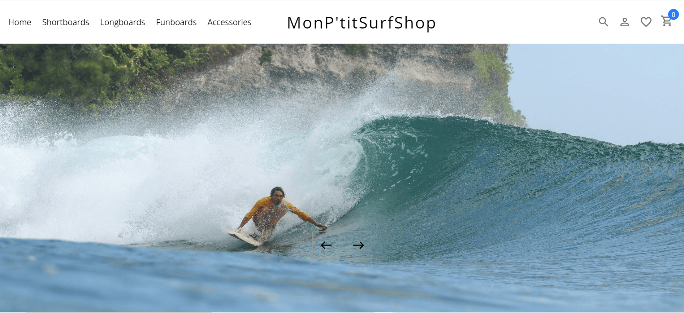

# MonPetitSurfShop

MonPetitSurfShop is an ecommerce shop where you can buy all type of surfboard.

## Main features

- Home page where you can find the category and featured product
- Category of either shortboard longboard funboard or accessories
- Product page with all detail of the product
- Cart where the user can see is shopping items and remove them if needed

## How to use the application?

### Step 1

The user choose a category of product

### Step 2

The user can filter product by sub category and price

### Step 3

Then user can add the article he desire to buy to his cart

## Technical aspects

The web site have a front-end coded with react
The back-end is made with strapi and postgresql that you can find in this repository: https://github.com/julienguyon12/apiSurfShop

### Deployment

The application is deployed on render.

## Contributing

Pull requests are welcome. For major changes, please open an issue first to discuss what you would like to change.
Please make sure to update tests as appropriate.

## Available Scripts

In the project directory, you can run:

### `npm start`

Runs the app in the development mode.\
Open [http://localhost:3000](http://localhost:3000) to view it in your browser.

The page will reload when you make changes.\
You may also see any lint errors in the console.

### `npm test`

Launches the test runner in the interactive watch mode.\
See the section about [running tests](https://facebook.github.io/create-react-app/docs/running-tests) for more information.

### `npm run build`

Builds the app for production to the `build` folder.\
It correctly bundles React in production mode and optimizes the build for the best performance.

The build is minified and the filenames include the hashes.\
Your app is ready to be deployed!

See the section about [deployment](https://facebook.github.io/create-react-app/docs/deployment) for more information.

### `npm run eject`

**Note: this is a one-way operation. Once you `eject`, you can't go back!**

If you aren't satisfied with the build tool and configuration choices, you can `eject` at any time. This command will remove the single build dependency from your project.

Instead, it will copy all the configuration files and the transitive dependencies (webpack, Babel, ESLint, etc) right into your project so you have full control over them. All of the commands except `eject` will still work, but they will point to the copied scripts so you can tweak them. At this point you're on your own.

You don't have to ever use `eject`. The curated feature set is suitable for small and middle deployments, and you shouldn't feel obligated to use this feature. However we understand that this tool wouldn't be useful if you couldn't customize it when you are ready for it.
